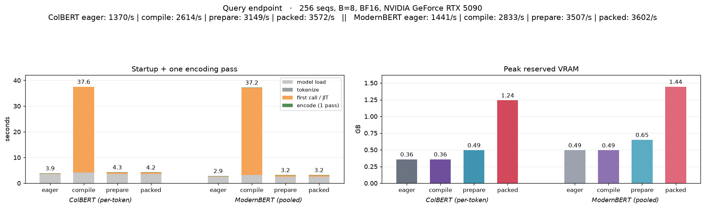
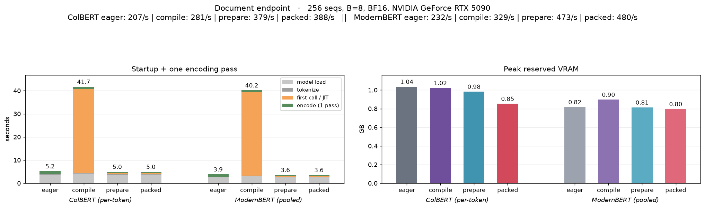
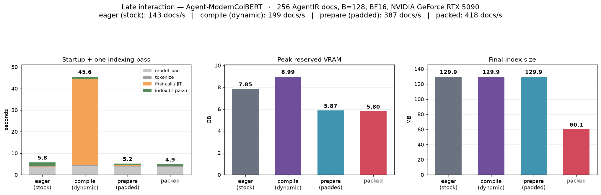
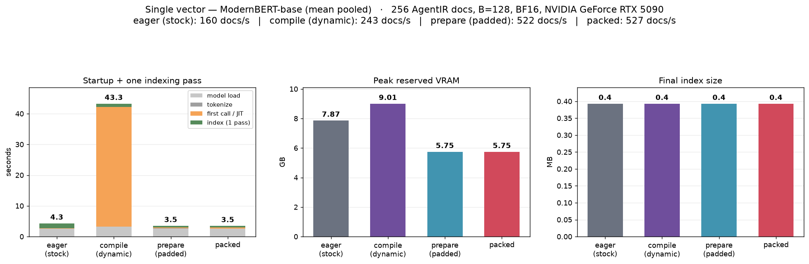
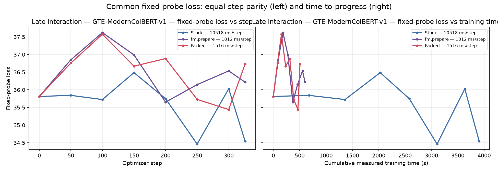
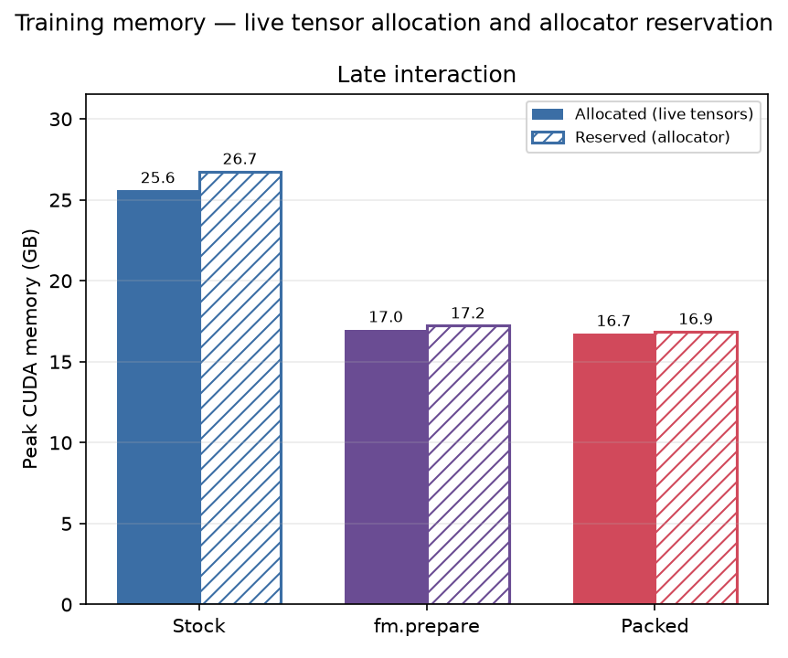
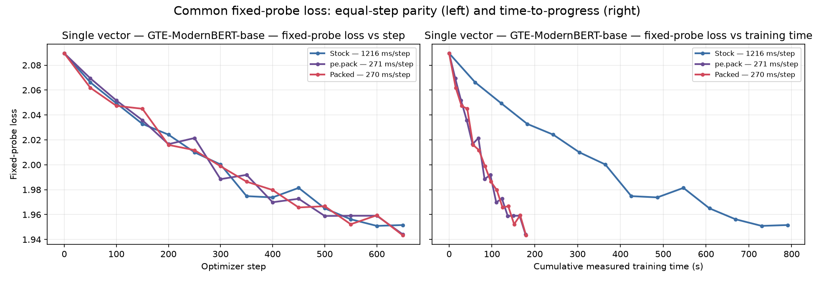
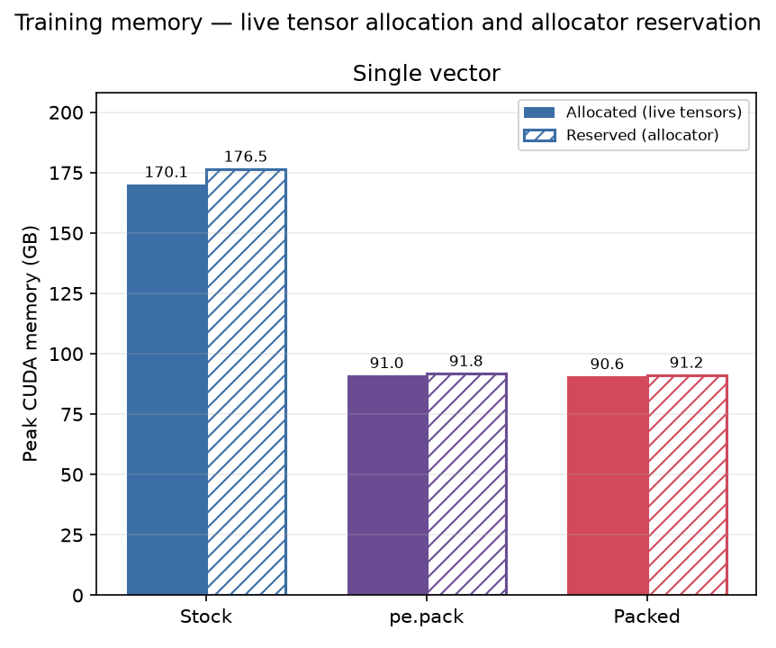

<div align="center">
  <h1>Packed Encoders</h1>
  <p align="center">
      
  </p>
</div>
<p align="center">
  
  
  
  
  <a href="https://developer.nvidia.com/cuda-toolkit"></a>
  <a href="https://github.com/NVIDIA/cutlass"></a>
  <a href="https://github.com/triton-lang/triton"></a>
</p>
<div align="center">
    A padding-free runtime for Encoders
</div>

&nbsp;

## ⭐️ Overview

`packed-encoders` is a high-performance execution engine for **ModernBERT** backbones. One call — `pe.pack(model)` — monkeypatches a live Hugging Face `ModernBertModel` **in place** with fused CuteDSL LayerNorm, RoPE, and GeGLU kernels, cuBLAS GEMMs, packed (padding-free) attention with per-GPU calibrated dispatch, and optional CUDA graphs.

The kernels consume Hugging Face's exact weight layout, so nothing is re-packed and no wrapper class exists. `state_dict`, `save_pretrained`, `from_pretrained`, and gradient checkpointing all remain HF's own (or any other wrappers on top of HF). `pe.unpack(model)` restores the stock forward.

**Inference**: **1.9–2.1x** document encoding and **2.5–2.6x** query encoding vs eager Hugging Face on an RTX 5090 (**1.3–1.5x** vs `torch.compile` max-autotune), at cosine ≥ 0.999 output parity.

**Indexing**: **2.9–3.3x** documents/second on a real long-document corpus, with **~26% less** peak reserved VRAM.

**Training**: **7.0x** median GradCache step time on a B200 running the Agent-ModernColBERT recipe — **4.6x** wall-clock even after paying all compile warmup — with **~37% less** per-step reserved memory and a bit-identical initial loss.

Check the [benchmark section](#benchmarks) for the full tables.

> [!NOTE]  
> ModernBERT backbones at `hidden_size` divisible by 256 are supported, this includes the obvious [ModernBERT](https://huggingface.co/answerdotai/ModernBERT-base) but also: any encoder trained with the same architecture (such as [Ettin](https://huggingface.co/jhu-clsp/ettin-encoder-1b) or [mmBERT](https://huggingface.co/jhu-clsp/mmBERT-base)), late-interaction encoders trained with ModernBERT as the base (such as [ModernColBERT](https://huggingface.co/lightonai/GTE-ModernColBERT-v1)) and any finetunes that sit on top of those. The package offers a `validate()` function to check compatibility.

&nbsp;

## Why packing?

Encoder runtimes were never meant to be rectangular, we're just inheriting decoder tooling and living with that. Queries are ~30 tokens, documents are hundreds to thousands, and contrastive batches mix both. Padding every sequence to the batch maximum spends real FLOPs, memory, and attention work on tokens that don't exist.

packed-encoders removes that waste in three layers, each usable independently:

1. **Fused tail** — CuteDSL LayerNorm / residual-LayerNorm / RoPE / GeGLU kernels plus cuBLAS GEMMs replace the stock layer internals. The kernels are shape-agnostic (the token count is a runtime grid dimension), so one compiled artifact serves every batch shape with no recompiles.
2. **Packed execution** — the padded `[B, S]` forward internally unpads to a flat `[total_tokens]` buffer and runs variable-length attention confined by `cu_seqlens`; pipelines that already collate without padding can call `packed_forward()` directly and skip the pad/unpad boundary entirely.
3. **Dispatch and graphs** — a per-GPU calibrated policy picks between a specialized packed Triton attention kernel and FlashAttention per batch, and optional bucketed CUDA graphs collapse the kernel-launch floor for short-sequence workloads.

## Installation

Install from PyPI:
```bash
uv pip install packed-encoders
```

or install from source:
```bash
git clone git@github.com:pau-mensa/packed-encoders.git
cd packed-encoders
uv sync                 # torch 2.8 (cu128) + transformers + CuteDSL
uv sync --extra fa2     # + compiled FlashAttention 2 (sm_120 / RTX 5090, Python 3.11)
uv sync --extra fa4     # + CuteDSL FlashAttention 4 (sm_90 / sm_100)
```

or straight into an existing environment:
```bash
uv pip install "packed-encoders @ git+https://github.com/pau-mensa/packed-encoders"
```

Notes on the pins:

- **torch is pinned to the 2.8 series on Python 3.10–3.13**. The prebuilt FlashAttention wheel for consumer Blackwell (sm_120) is ABI-locked to torch 2.8 and Python 3.11; on other Python versions use the in-tree Triton or SDPA backend. Python 3.14 uses torch 2.9, the first release with cp314 wheels.
- On **sm_90 / sm_100** (H100/H200/B200) install `flash-attn-4` instead, the loader auto-selects the CuteDSL FA4 kernel there.
- FlashAttention is optional: the packed Triton kernel ships in-tree and SDPA needs no extra dependency. On large token budgets (large batches or long documents) FA is heavily recommended.
- Framework extras (`--extra sentence-transformers`, `--extra pylate`) exist for convenience; the package only requires them if you actually pass those objects to `pack()`.

### Requirements

- An NVIDIA GPU of compute capability sm_80, sm_89, sm_90, sm_100, or sm_120, with a working `ptxas` (CuteDSL JIT-compiles at runtime).
- bf16 weights for inference, or fp32 master weights under bf16 autocast for training.

## ⚡️ Quick Start

```python
import packed_encoders as pe
from transformers import AutoModel

model = AutoModel.from_pretrained("answerdotai/ModernBERT-base", dtype="bfloat16").cuda()
pe.pack(model)                      # validated fused forward, installed in place
out = model(input_ids=ids, attention_mask=mask).last_hidden_state
```

`pack()` locates the encoder inside whatever you hand it — a raw HF model, a `SentenceTransformer`, or a PyLate `ColBERT`:

```diff
  from sentence_transformers import SentenceTransformer
  st = SentenceTransformer("answerdotai/ModernBERT-base").cuda().bfloat16()
+ pe.pack(st)
  emb = st.encode(texts)
```

```diff
  from pylate import models
  colbert = models.ColBERT(model_name_or_path="lightonai/GTE-ModernColBERT-v1")
+ pe.pack(colbert)
  train_loss = losses.CachedContrastive(model=colbert, ...)
```

## Usage

### Attention backends

```python
pe.pack(model, attention_backend="auto")   # default when an optimized kernel is importable
```

| Backend | What it is |
|---|---|
| `"auto"` | Calibrated per-batch choice between the packed Triton kernel and FlashAttention. Exact-card policies exist for RTX 5090, A100-SXM4-40GB, L40S, H200, and B200; uncalibrated cards conservatively prefer Flash. |
| `"triton"` | The in-tree packed short-attention kernel — no-grad bf16 ModernBERT-base geometry (12 × 64 heads), global or local-64 attention, `Smax ≤ 128`. Invariant misses prefer Flash, then SDPA. |
| `"flash"` | FlashAttention with sliding-window pruning; varlen kernel on padded batches. FA2 wheel on sm_120, CuteDSL FA4 on sm_90/sm_100. Raises if no kernel is present. |
| `"sdpa"` | Dependency-free dense-mask attention. The explicit safe choice and the final fallback. |

The dispatch policy uses only host-visible shapes (never device values, so it stays CUDA-graph-capturable) and was fit per card against measured crossovers: on the RTX 5090 the Triton kernel wins below **20,736 live tokens** and FA2 above; at the kernel level the specialized Triton kernel is **1.4–2.1x** faster than FA2 in its envelope. Policies are exact-card and backend-version specific by design — see the [`benchmarks/` guide](benchmarks/README.md) for the formulas, sweeps, parity numbers, and reproduction commands.

### CUDA graphs

The package also offers the possibility of using CUDA graphs for short-sequence inference, which is usually host-launch-bound; the bucketed graph runner collapses the whole forward to a single replay:

```python
# Rectangular graphs over padded (B, S) buckets:
pe.pack(model, cuda_graph=True, attention_backend="sdpa")

# Packed graphs (auto/triton/flash) need explicit batch and sequence bounds:
pe.pack(model, cuda_graph=pe.GraphConfig(
    pad_to=64, max_batch=256, max_seq=128, max_graphs=32,
))

with pe.no_cuda_graph(model):          # bypass for a one-off odd shape
    out = model(input_ids=huge_ids, attention_mask=huge_mask)
pe.set_cuda_graph(model, False)        # or flip after the fact
```

- Graphs engage only when gradients and CUDA autocast are both disabled; out-of-bucket shapes fall back to the eager fused forward automatically.
- `cuda_graph=True` only captures calls with `S ≤ 64` (`cuda_graph_seq_cutoff`), which keeps graphs only on short S regimes.
- The attention backend is resolved before capture and baked into each graph, so replay does zero dispatch work.
- Kill switch: `PACKED_ENCODERS_GRAPH=0` disables all graph runners globally.

Training has its own captured forward+backward runner:

```python
pe.pack(model, train_cuda_graph=pe.TrainGraphConfig(max_seq=64))
```

with two caller invariants: `optimizer.zero_grad(set_to_none=False)` (the backward graph writes into persistent `.grad`) and fixed `(B, S)` shapes per captured step.

> [!TIP]
> CUDA Graphs for training only help if the training regime is very short `S` bounded, both for documents and queries, for instance if the query length is 32 and the document length is 128.

### Check if your encoder is supported with `validate()`

`pack()` runs `validate()` by default (`validate=False` to skip). It checks:

1. the model architecture (`config.model_type`, and with it the split-half RoPE convention the kernels assume);
2. the compute capability against the validated matrix: sm_80, sm_89, sm_90, sm_100, sm_120;
3. that the CuteDSL toolchain can JIT a kernel on this machine;
4. that the fused forward tracks stock HF within the bf16 band (cosine ≥ 0.997 at S = 128/512/2048).

The packed forward requires `input_ids`; `inputs_embeds`, attention/hidden-state outputs, and non-zero `token_type_ids` are not supported.

### Fully packed execution (advanced)

`pack()` keeps the public padded interface. If your pipeline already collates without padding, `packed_forward()` is the direct entry:

```python
import torch
from packed_encoders.config import ModernBertParams
from packed_encoders.forward import packed_forward

params = ModernBertParams.from_hf_config(model.config)
# three sequences of lengths 5, 3, 8 — concatenated, zero pad tokens
packed_ids   = torch.cat([ids_a, ids_b, ids_c])                             # [16]
cu_seqlens   = torch.tensor([0, 5, 8, 16], dtype=torch.int32, device="cuda")
position_ids = torch.cat([torch.arange(n) for n in (5, 3, 8)]).cuda()       # [16]

hidden = packed_forward(model, params, packed_ids, cu_seqlens, 8, position_ids)  # [16, H]
```

> [!IMPORTANT]
> If you want to use it for training you'll also have to use a custom packed loss as well.

&nbsp;

## Benchmarks

All numbers come from real `Tevatron/AgentIR-data` queries and long documents, are PyTorch-vs-PyTorch comparisons, and report peak **reserved** VRAM. Every accelerated path is parity-checked against eager stock before a result is published (cosine ≥ 0.999 on these runs). Configs, runners, protocols, and remote launchers live in [`benchmarks/`](benchmarks/README.md).

> [!IMPORTANT]
> These benchmarks were done on a 5090 and a B200 and are just the headline. You should measure your own use case and pick the config that works best for you.

### Inference (RTX 5090, batch 8)

Queries are capped at 128 tokens (dispatch-bound; CUDA graphs enabled on the packed paths), documents at 2048 (compute-bound; graphs deliberately off). Sequences/second, higher is better:

| Endpoint | Model family | Eager HF | `torch.compile` | `pe.pack` | Fully packed |
|---|---|---:|---:|---:|---:|
| Queries (≤128) | ColBERT (PyLate) | 1,370 | 2,614 | 3,149 | **3,572 (+160%)** |
| Queries (≤128) | single-vector (ST) | 1,441 | 2,833 | 3,507 | **3,602 (+150%)** |
| Documents (≤2048) | ColBERT (PyLate) | 207 | 281 | 379 | **388 (+87%)** |
| Documents (≤2048) | single-vector (ST) | 232 | 329 | 473 | **480 (+106%)** |

On documents the packed path is faster *and* leaner than eager (0.80-0.85 vs 0.82-1.04 GB reserved). On queries the graphed packed path deliberately trades memory for throughput (~1.2-1.4 GB reserved vs ~0.4-0.5 eager).





### Indexing (RTX 5090, batch 128, documents ≤2048)

| Model family | Eager HF | `torch.compile` | `pe.pack` | Fully packed | Peak reserved |
|---|---:|---:|---:|---:|---|
| ColBERT (PyLate) | 143 docs/s | 199 | 387 | **418 (2.9x)** | 7.85 → 5.80 GB (−26%) |
| single-vector (ST) | 160 docs/s | 243 | 522 | **527 (3.3x)** | 7.87 → 5.75 GB (−27%) |

The fully packed late-interaction index is also **2.15x smaller** on disk (60 MB vs 129 MB for the same corpus) because no rectangular token tensor or mask is stored.





### Training (NVIDIA B200)

#### Multi-vector (late interaction)

The Agent-ModernColBERT recipe — `lightonai/GTE-ModernColBERT-v1`, GradCache (CachedContrastive), B=32 with 7 negatives, query/document caps 8192/4096, 326 optimizer steps over two epochs:

| | Stock | `pe.pack` | Fully packed |
|---|---:|---:|---:|
| Median step time | 10,518 ms | 1,812 ms (**5.8x**) | 1,516 ms (**7.0x**) |
| Wall clock, *including* all compile warmup | 65m 06s | 16m 39s (**3.91x**) | 14m 18s (**4.55x**) |
| Per-step peak reserved | 26.7 GB | 17.2 GB (−36%) | 16.9 GB (−37%) |





#### Single vector

`gte-modernbert-base`, full in-batch negatives, B=16, query/document caps 128/2048, 650 optimizer steps over two epochs:

| | Stock | `pe.pack` | Fully packed |
|---|---:|---:|---:|
| Median step time | 1,216 ms | 271 ms (**4.5x**) | 270 ms (**4.5x**) |
| Per-step peak reserved | 176.5 GB | 91.8 GB (−48%) | 91.2 GB (−48%) |





All variants start from a bit-identical initial probe loss and follow comparable optimization trajectories under the same data and training configuration.

> [!NOTE]
> The B200 showcase was measured with PyTorch 2.11; the package's supported installation matrix is PyTorch 2.8–2.9. See the training protocol for the complete benchmark environment.

### Reproducibility

The runners and canonical configs are checked in; the figures above are snapshots from the published reference runs. See the protocols for [inference](benchmarks/docs/inference.md), [indexing](benchmarks/docs/indexing.md), and [training](benchmarks/docs/training.md) for the exact environment, methodology, and parity gates. Attention crossover calibration is documented in the same [`benchmarks/` guide](benchmarks/README.md).

&nbsp;

## Tests

```bash
uv run pytest tests/
```

The suite covers kernel numerics (LayerNorm, matmul, short attention — tile boundaries, raggedness, cross-sequence isolation, determinism), backend selection and dispatch-score logic, CUDA-graph bucketing for inference and training, and padded/packed forward-backward parity against stock Hugging Face.

## Contributing

Contributions are welcome, especially for:
- Supporting more encoder families
- Reach a higher level of abstraction that can result in supporting a generic packed encoder runtime

## Citation

```bibtex
@software{packedencoders,
  author = {Montserrat, Pau},
  title = {packed-encoders: a padding-free runtime for encoders},
  year = {2026},
  url = {https://github.com/pau-mensa/packed-encoders}
}
```

## Acknowledgments

- [Answer.AI / LightOn](https://huggingface.co/answerdotai/ModernBERT-base) for ModernBERT, and [LightOn](https://github.com/lightonai/pylate) for PyLate and the GTE-ModernColBERT models used throughout the showcase.
- [IBM Research Israel](https://github.com/roipony/flash-maxsim) for the Flash-MaxSim kernel the showcase's MaxSim scoring builds on.
- [Tri Dao et al.](https://github.com/Dao-AILab/flash-attention) for FlashAttention, and NVIDIA for [CUTLASS / CuteDSL](https://github.com/NVIDIA/cutlass).

## License

MIT. [`benchmarks/helpers/flash_maxsim_packed.py`](benchmarks/helpers/flash_maxsim_packed.py) builds on [flash-maxsim](https://github.com/roipony/flash-maxsim), which is licensed under Apache-2.0.
